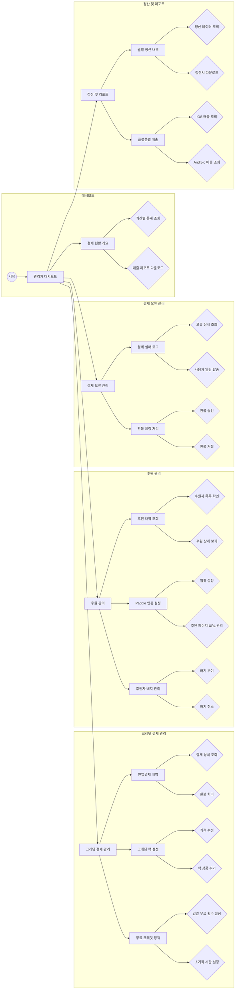

```mermaid
flowchart LR

  subgraph s1 ["대시보드"]
    n1(("시작"))
    n2["관리자 대시보드"]
    n3["결제 현황 개요"]
    n4{"기간별 통계 조회"}
    n5{"매출 리포트 다운로드"}
  end

  subgraph s2 ["크레딧 결제 관리"]
    n6["크레딧 결제 관리"]
    n7["인앱결제 내역"]
    n8{"결제 상세 조회"}
    n9{"환불 처리"}
    n10["크레딧 팩 설정"]
    n11{"가격 수정"}
    n12{"팩 상품 추가"}
    n13["무료 크레딧 정책"]
    n14{"일일 무료 횟수 설정"}
    n15{"초기화 시간 설정"}
  end

  subgraph s3 ["후원 관리"]
    n16["후원 관리"]
    n17["후원 내역 조회"]
    n18{"후원자 목록 확인"}
    n19{"후원 상세 보기"}
    n20["Paddle 연동 설정"]
    n21{"웹훅 설정"}
    n22{"후원 페이지 URL 관리"}
    n23["후원자 배지 관리"]
    n24{"배지 부여"}
    n25{"배지 취소"}
  end

  subgraph s4 ["결제 오류 관리"]
    n26["결제 오류 관리"]
    n27["결제 실패 로그"]
    n28{"오류 상세 조회"}
    n29{"사용자 알림 발송"}
    n30["환불 요청 처리"]
    n31{"환불 승인"}
    n32{"환불 거절"}
  end

  subgraph s5 ["정산 및 리포트"]
    n33["정산 및 리포트"]
    n34["월별 정산 내역"]
    n35{"정산 데이터 조회"}
    n36{"정산서 다운로드"}
    n37["플랫폼별 매출"]
    n38{"iOS 매출 조회"}
    n39{"Android 매출 조회"}
  end

  n1 --> n2
  n2 --> n3
  n3 --> n4
  n3 --> n5
  n2 --> n6
  n6 --> n7
  n7 --> n8
  n7 --> n9
  n6 --> n10
  n10 --> n11
  n10 --> n12
  n6 --> n13
  n13 --> n14
  n13 --> n15
  n2 --> n16
  n16 --> n17
  n17 --> n18
  n17 --> n19
  n16 --> n20
  n20 --> n21
  n20 --> n22
  n16 --> n23
  n23 --> n24
  n23 --> n25
  n2 --> n26
  n26 --> n27
  n27 --> n28
  n27 --> n29
  n26 --> n30
  n30 --> n31
  n30 --> n32
  n2 --> n33
  n33 --> n34
  n34 --> n35
  n34 --> n36
  n33 --> n37
  n37 --> n38
  n37 --> n39
```
