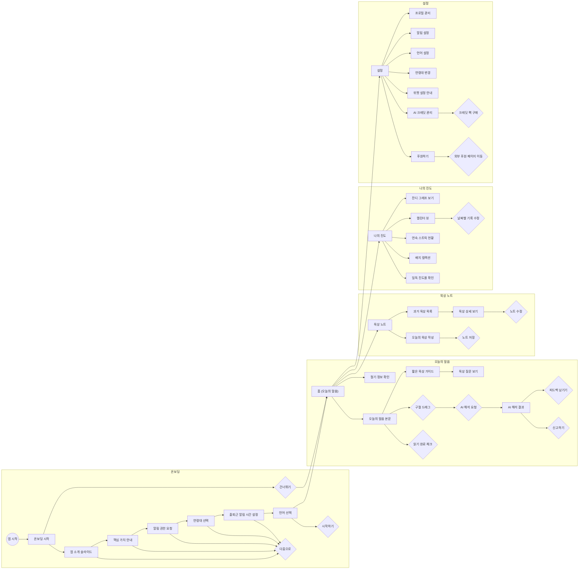

```mermaid
flowchart LR

  subgraph s1 ["온보딩"]
    n1(("앱 시작"))
    n2["온보딩 시작"]
    n3["앱 소개 슬라이드"]
    n4["핵심 가치 안내"]
    n5["알림 권한 요청"]
    n6["연령대 선택"]
    n7["출퇴근 알림 시간 설정"]
    n8["언어 선택"]
    n9{"건너뛰기"}
    n10{"다음으로"}
    n11{"시작하기"}
  end

  subgraph s2 ["오늘의 말씀"]
    n12["홈 (오늘의 말씀)"]
    n13["절기 정보 확인"]
    n14["오늘의 말씀 본문"]
    n15["짧은 묵상 가이드"]
    n16["묵상 질문 보기"]
    n17{"구절 드래그"}
    n18{"AI 해석 요청"}
    n19{"읽기 완료 체크"}
    n43["AI 해석 결과"]
    n44{"피드백 남기기"}
    n45{"신고하기"}
  end

  subgraph s3 ["묵상 노트"]
    n20["묵상 노트"]
    n21["오늘의 묵상 작성"]
    n22["과거 묵상 목록"]
    n23["묵상 상세 보기"]
    n24{"노트 저장"}
    n25{"노트 수정"}
  end

  subgraph s4 ["나의 진도"]
    n26["나의 진도"]
    n27["잔디 그래프 보기"]
    n28["캘린더 뷰"]
    n29["연속 스트릭 현황"]
    n30["배지 컬렉션"]
    n31["일독 진도율 확인"]
    n32{"날짜별 기록 수정"}
  end

  subgraph s5 ["설정"]
    n33["설정"]
    n34["프로필 관리"]
    n35["알림 설정"]
    n36["언어 설정"]
    n37["연령대 변경"]
    n38["위젯 설정 안내"]
    n39["AI 크레딧 관리"]
    n40["후원하기"]
    n41{"크레딧 팩 구매"}
    n42{"외부 후원 페이지 이동"}
  end

  n1 --> n2
  n2 --> n3
  n3 --> n4
  n4 --> n5
  n5 --> n6
  n6 --> n7
  n7 --> n8
  n8 --> n12
  n2 --> n9
  n9 --> n12
  n3 --> n10
  n4 --> n10
  n5 --> n10
  n6 --> n10
  n7 --> n10
  n8 --> n11
  n12 --> n13
  n12 --> n14
  n14 --> n15
  n15 --> n16
  n14 --> n17
  n17 --> n18
  n18 --> n43
  n43 --> n44
  n43 --> n45
  n14 --> n19
  n12 --> n20
  n20 --> n21
  n20 --> n22
  n22 --> n23
  n21 --> n24
  n23 --> n25
  n12 --> n26
  n26 --> n27
  n26 --> n28
  n26 --> n29
  n26 --> n30
  n26 --> n31
  n28 --> n32
  n12 --> n33
  n33 --> n34
  n33 --> n35
  n33 --> n36
  n33 --> n37
  n33 --> n38
  n33 --> n39
  n33 --> n40
  n39 --> n41
  n40 --> n42
```
